# Hydraulischer Fluss — Hauswasseranschluss → Brauchwasser & Fußbodenheizung

**Anlage:** Vaillant aroTHERM pro VWL 115/7.1 A (11,5 kW)
**Heizkreis:** Fußbodenheizung, 4 Schleifen (Küche, Bad, Flur, Wohnzimmer)
**Brauchwasser:** 10 Verbraucher (Küche, Bad, Keller, Außen) — s. Tabelle unten
**Anbindungsvariante:** Systemtrennung (WP → Puffer → Heizkreis über Plattenwärmetauscher)

> Quelle: `data/normen/waermepumpe-normen-uebersicht.md`, Kapitel 5

---

## Diagramm

```mermaid
flowchart TD
    %% ===== Hauswasseranschluss (Trinkwasser) =====
    HWA["🏠 [HYD.KAL.Hauswasseranschluss]<br/>Hauswasseranschluss<br/>(Trinkwasser, 3 bar)"]
    ZAE["[HYD.KAL.Zaehler] + [HYD.KAL.Absperrventil_Haupt]<br/>Zähler / Absperrventil<br/>DIN 1986-100"]
    HWA ==> ZAE

    %% ===== Trinkwasser-Pfad (über Boiler) =====
    subgraph TWP ["Trinkwasser-Pfad"]
        direction TB
        ZAE ==>|"kaltes Wasser (Kaltwasser-Hauptleitung)"| KALT["Kaltwasser-Verteiler"]
        ZAE ==>|"kaltes Wasser (Zulauf)"| BOILER_IN["[HYD.WAR.Boiler_TWW]<br/>Warmwasser-Boiler<br/>(Trinkwasser)<br/>DIN EN 13203"]
        BOILER_IN -->|"warmes Wasser (HW)"| WARM["Warmwasser-Verteiler"]
    end

    %% ===== Brauchwasser-Verbraucher: Küche =====
    subgraph KUECHE ["Küche"]
        direction TB
        KB_SPUEL["🍽️ Mischbatterie Spülbecken<br/>(KW + HW)"]
        KB_GSP["🫧 Geschirrspüler<br/>(nur KW)"]
    end

    %% ===== Brauchwasser-Verbraucher: Bad =====
    subgraph BAD ["Bad"]
        direction TB
        BD_WASCH["🚿 Mischbatterie Waschbecken<br/>(KW + HW)"]
        BD_DUSCHE["🚿 Mischbatterie Dusche<br/>(KW + HW)"]
        BD_WANNE["🛁 Mischbatterie Badewanne<br/>(KW + HW)"]
    end

    %% ===== Brauchwasser-Verbraucher: Keller =====
    subgraph KELLER ["Keller"]
        direction TB
        KL_WP["❄️ Zuleitung Wärmepumpe<br/>(nur KW, Füllwasser)"]
        KL_WM["🧺 Waschmaschine<br/>(nur KW)"]
        KL_WASCH["🚿 Mischbatterie Waschbecken<br/>(KW + HW)"]
        KL_DUSCHE["🚿 Mischbatterie Dusche<br/>(KW + HW)"]
    end

    %% ===== Brauchwasser-Verbraucher: Außen =====
    subgraph AUSSEN ["Außen"]
        direction TD
        AU_GARTEN["🌿 Gartenbewässerung<br/>(nur KW)"]
    end

    %% ===== Verbindungen: Verteiler → Verbraucher (Kaltwasser) =====
    KALT --> KB_SPUEL
    KALT --> KB_GSP
    KALT --> BD_WASCH
    KALT --> BD_DUSCHE
    KALT --> BD_WANNE
    KALT --> KL_WP
    KALT --> KL_WM
    KALT --> KL_WASCH
    KALT --> KL_DUSCHE
    KALT --> AU_GARTEN

    %% ===== Verbindungen: Verteiler → Verbraucher (Warmwasser) =====
    WARM --> KB_SPUEL
    WARM --> BD_WASCH
    WARM --> BD_DUSCHE
    WARM --> BD_WANNE
    WARM --> KL_WASCH
    WARM --> KL_DUSCHE

    %% ===== WP-Primärkreis (Niederdruckseite) =====
    subgraph PRIM ["WP-Primärkreis (Systemtrennung, WP-Seite)"]
        direction TB
        WP["❄️ [HYD.HEI.Waermepumpe]<br/>VWL 115/7.1 A<br/>aroTHERM pro<br/>3~/400 V, R290"]
        PUMP1["[HYD.HEI.Pumpe_WP_Seite]<br/>Heizungspumpe WP-Seite<br/>EEI ≤ 0,23<br/>DIN EN ISO 5149"]
        RFV["[HYD.HEI.Rueckflussverhinderer]<br/>Rückflussverhinderer<br/>(WP-Seite)<br/>VDE-AR-E 2105-100"]
        FILTER["[HYD.HEI.Schmutzfanger_Filter]<br/>Filter / Schmutzfänger<br/>≤ 2 mm Masche<br/>DIN 1986-100"]
        DFW["[HYD.HEI.Durchflusswaechter]<br/>Durchflusswächter<br/>Mindestumlauf ~2–3 m³/h<br/>VDE-AR-E 2105-100"]

        WP --> PUMP1
        PUMP1 --> RFV
        RFV --> FILTER
        FILTER --> DFW
    end

    %% ===== Sicherheitsgruppe (am höchsten Punkt) =====
    subgraph SG ["Sicherheitsgruppe<br/>(höchster Punkt Heizkreis)"]
        direction TB
        SV["[HYD.HEI.Sicherheitsventil_3bar]<br/>Sicherheitsventil<br/>3 bar<br/>DIN EN 12828"]
        MAG["[HYD.HEI.Membranausdehnungsgefaess]<br/>Membranausdehnungsgefäß<br/>vorgepresst, ~10 % Füllmenge<br/>DIN EN 12828"]
        EV["[HYD.HEI.Entluftungsventil_auto]<br/>Entlüftungsventil<br/>(automatisch)<br/>DIN EN 12828"]
    end

    %% ===== Puffer (Systemtrennung) =====
    subgraph PF ["Pufferspeicher<br/>(Heizpuffer)"]
        direction TB
        PUFFER["[HYD.HEI.Pufferspeicher]<br/>Pufferspeicher<br/>DIN EN 12897<br/>~600–2.000 l (Systemtrennung)"]
        PWT["[HYD.HEI.Plattenwaermetauscher]<br/>Plattenwärmetauscher<br/>DIN EN 12897<br/>(Systemtrennung, ≥ WP-Nennleistung)"]
    end

    %% ===== Heizkreis (Sekundärseite → Fußbodenheizung) =====
    subgraph HEIZ ["Heizkreis (Sekundärseite → Fußbodenheizung)"]
        direction TB
        PUMP2["[HYD.HEI.Pumpe_Heizkreis]<br/>Heizungspumpe Heizkreis<br/>EEI ≤ 0,23<br/>DIN EN ISO 5149"]
        ABSP_VL["[HYD.HEI.Absperrventil_Vorlauf]<br/>Absperrventil Vorlauf<br/>DIN 1986-100"]
        ABSP_RL["[HYD.HEI.Absperrventil_Ruecklauf]<br/>Absperrventil Rücklauf<br/>DIN 1986-100"]
        VERT["[HYD.HEI.FBH_Verteiler]<br/>Verteiler<br/>(4 Wege)"]

        PUMP2 --> ABSP_VL
        ABSP_RL --> VERT
    end

    %% ===== Fußbodenheizung Schleifen =====
    subgraph FBH ["Fußbodenheizung — 4 Schleifen"]
        direction LR
        S1["[HYD.HEI.FBH_Schleife.01]<br/>Schleife 1<br/>🍳 Küche"]
        S2["[HYD.HEI.FBH_Schleife.02]<br/>Schleife 2<br/>🛁 Bad"]
        S3["[HYD.HEI.FBH_Schleife.03]<br/>Schleife 3<br/>🚶 Flur"]
        S4["[HYD.HEI.FBH_Schleife.04]<br/>Schleife 4<br/>🛋️ Wohnzimmer"]
    end

    %% ===== Verbindungen: Primärkreis → Puffer → Heizkreis =====
    DFW -->|"WP-Vorlauf (heiß)"| PUFFER
    PUFFER -->|"Puffer-Rücklauf"| WP

    %% Sicherheitsgruppe an Primärkreis
    PUFFER --- SG

    %% Puffer → Heizkreis über Plattenwärmetauscher
    PUFFER -->|"Primärseite"| PWT
    PWT -->|"Sekundärseite (heiß)"| PUMP2

    %% Heizkreis → Verteiler → Schleifen
    ABSP_VL --> VERT
    VERT --> S1
    VERT --> S2
    VERT --> S3
    VERT --> S4

    %% Rücklauf Schleifen → Verteiler → Heizkreis-Rücklauf
    S1 -->|"Rücklauf"| VERT
    S2 -->|"Rücklauf"| VERT
    S3 -->|"Rücklauf"| VERT
    S4 -->|"Rücklauf"| VERT

    %% Heizkreis-Rücklauf → Puffer (Sekundärseite)
    VERT --> ABSP_RL

    %% Boiler wird über Puffer/Heizkreis beheizt
    PUFFER -->|"WP-Wärme (HW-Erzeugung)"| BOILER_IN

    %% ===== Styling =====
    classDef wp fill:#e3f2fd,stroke:#1565c0,stroke-width:2px
    classDef puffer fill:#fff3e0,stroke:#e65100,stroke-width:2px
    classDef sg fill:#fce4ec,stroke:#c62828,stroke-width:1px
    classDef fbh fill:#e8f5e9,stroke:#2e7d32,stroke-width:1px
    classDef tw fill:#f3e5f5,stroke:#6a1b9a,stroke-width:1px

    class WP wp
    class PUFFER,PWT puffer
    class SV,MAG,EV sg
    class S1,S2,S3,S4 fbh
    class BOILER_IN,ZIRK tw
```



### Variante B: Integrierte Hydraulikstation (Vaillant VWZ MEH 97-7)

Die **VWZ MEH** ist eine vormontierte Inneneinheit der aroTHERM pro, die mehrere Komponenten des Primärkreises bereits integriert. Bei Verwendung der Hydraulikstation entfallen die separaten Komponenten #8–#11 und #14–#15:

```
┌────────────────────────────────────────────────────────┐
│  [HYD.HEI.Waermepumpe]                                 │
│  VWL 115/7.1 A (WP)                                    │
└───────────────┬────────────────────────────────────────┘
                │ 1" (Heizung) / G 1¼" (Wärmequelle)
                ▼
┌────────────────────────────────────────────────────────┐
│  [HYD.HEI.Hydraulikstation] (VWZ MEH 97-7)             │
│                                                        │
│  ┌────────────────┐  ┌───────────┐  ┌────────────────┐ │
│  │ Heizkreispumpe │  │ Umschalt- │  │ Sicherheitsgr. │ │
│  │ (vormontiert ) │  │ ventil    │  │ SV + MAG 10L   │ │
│  └────────────────┘  └───────────┘  └────────────────┘ │
│                                                        │
│  + Heizstab (8,5 kW)                                   │
│  + VR 940 Gateway / HMI-Display                        │
└────────────────────┬───────────────────────────────────┘
                     │
       ┌─────────────┴────────────────┐
       ▼                              ▼
  [HYD.HEI.Pufferspeicher]   [HYD.WAR.Boiler_TWW]
       │                              │
  ┌────┴────┐                         ▼
  ▼         ▼                   [HW-Verteiler]
[HYD.HEI.FBH_Schleife.01–xx]  (Mischbatterien)
```

> **Hinweis:** Bei VWZ MEH sind die Komponenten #8 (Pumpe WP-Seite), #9 (RFV),
> #10 (Filter), #11 (Durchflusswächter), #14 (Sicherheitsventil) und
> #15 (MAG) **bereits integriert** und werden nicht zusätzlich installiert.
> Der Durchflusswächter ist in der Regelung der Hydraulikstation enthalten
> (Mindestumlauf-Schutz).
>
> **Nicht integriert** in der VWZ MEH: Pufferspeicher, Plattenwärmetauscher,
> Entlüftungsventil (je nach Kreis), Heizungspumpe Heizkreis (Sekundärseite).
> Diese Komponenten werden weiterhin separat benötigt, falls die Anlagendimensionierung
> es erfordert (z. B. Puffer bei Radiatoren oder > 6 FBH-Zonen).

---

## Komponenten-Übersicht (Kapitel 5 → Position im Diagramm)

| # | Komponente (§5.2 / §5.3) | ID (komponenten.md) | Position im Fluss | Norm |
|---|---|---|---|---|
| 1 | **Hauswasseranschluss** (Trinkwasser) | `HYD.KAL.Hauswasseranschluss` | Eingang, speist Boiler mit kaltem Wasser | DIN 1986-100 |
| 2 | **Zähler / Absperrventil** | `HYD.KAL.Zaehler` + `HYD.KAL.Absperrventil_Haupt` | Direkt am Hauswasseranschluss | DIN 1986-100 |
| 3 | **Kaltwasser-Verteiler** | — (Verteilungspunkt) | Nach Zähler; speist alle KW-Verbraucher + Boiler-Zulauf | DIN 1986-100 |
| 4 | **Warmwasser-Boiler** (§5.3) | `HYD.WAR.Boiler_TWW` | Trinkwasser-Pfad; wird über Puffer-Wärme beheizt | DIN EN 13203 |
| 5 | **Warmwasser-Verteiler** | — (Verteilungspunkt) | Nach Boiler; speist alle HW-Verbraucher (Mischbatterien) | DIN 1986-100 |
| 6 | **Zirkulationspumpe** (§5.3) | `HYD.WAR.Zirkulationspumpe` | Optional, nur bei HW-Schleife > 15 m (z. B. Bad + Keller) | EEI ≤ 0,23 |
| 7 | **VWL 115/7.1 A** (Wärmepumpe) | `HYD.HEI.Waermepumpe` | Primärkreis, erzeugt Wärme aus Luft → Wasser | VDE-AR-E 2105-100 |
| **7a** | **Hydraulikstation VWZ MEH 97-7** (Variante B) | `HYD.HEI.Hydraulikstation` | Vormontierte Inneneinheit; ersetzt #8–#11 + #14–#15 | VDE-AR-E 2105-100 |
| 8 | **Heizungspumpe WP-Seite** (§5.2) *(nur Variante A)* | `HYD.HEI.Pumpe_WP_Seite` | Direkt nach WP, fördert Wasser im Primärkreis | DIN EN ISO 5149, EEI ≤ 0,23 |
| 9 | **Rückflussverhinderer** (§5.2) *(nur Variante A)* | `HYD.HEI.Rueckflussverhinderer` | Nach WP-Pumpe, verhindert Rückstrom in WP bei Pufferbetrieb | VDE-AR-E 2105-100 |
| 10 | **Filter / Schmutzfänger** (§5.2) *(nur Variante A)* | `HYD.HEI.Schmutzfanger_Filter` | Nach RFV, feine Masche ≤ 2 mm, schützt WP | DIN 1986-100 |
| 11 | **Durchflusswächter** (§5.2) *(nur Variante A)* | `HYD.HEI.Durchflusswaechter` | Nach Filter, schaltet WP ab bei < 2–3 m³/h | VDE-AR-E 2105-100 |
| 12 | **Pufferspeicher** (§5.3) | `HYD.HEI.Pufferspeicher` | Zwischen Primär- und Sekundärkreis; ~600–2 000 l | DIN EN 12897 |
| 13 | **Plattenwärmetauscher** (§5.3) | `HYD.HEI.Plattenwaermetauscher` | Im/nach Puffer, trennt Primär- und Sekundärkreis hydraulisch | DIN EN 12897 |
| 14 | **Sicherheitsventil** (§5.2) *(nur Variante A)* | `HYD.HEI.Sicherheitsventil_3bar` | Höchster Punkt des Heizkreises, 3 bar | DIN EN 12828 |
| 15 | **Membranausdehnungsgefäß** (§5.2) *(nur Variante A)* | `HYD.HEI.Membranausdehnungsgefaess` | An Sicherheitsgruppe, ~10 % der Füllmenge | DIN EN 12828 |
| 16 | **Entlüftungsventil** (§5.2) | `HYD.HEI.Entluftungsventil_auto` | Höchster Punkt, automatisch | DIN EN 12828 |
| 17 | **Heizungspumpe Heizkreis** (§5.2) *(nur Variante A)* | `HYD.HEI.Pumpe_Heizkreis` | Sekundärseite, fördert Wasser zu den Schleifen; bei VWZ MEH: Heizkreispumpe integriert | DIN EN ISO 5149, EEI ≤ 0,23 |
| 18 | **Absperrventil Vorlauf** (§5.2) | `HYD.HEI.Absperrventil_Vorlauf` | Sekundärseite, vor Verteiler — Wartungszugang | DIN 1986-100 |
| 19 | **Absperrventil Rücklauf** (§5.2) | `HYD.HEI.Absperrventil_Ruecklauf` | Sekundärseite, nach Verteiler — Wartungszugang | DIN 1986-100 |
| 20 | **Verteiler (4 Wege)** | `HYD.HEI.FBH_Verteiler` | Sekundärseite, teilt auf 4 FBH-Schleifen | — |
| 21 | **Schleife: Küche** | `HYD.HEI.FBH_Schleife.01` | Fußbodenheizung, Zone 1 | — |
| 22 | **Schleife: Bad** | `HYD.HEI.FBH_Schleife.02` | Fußbodenheizung, Zone 2 (höchste VL-Temp.) | — |
| 23 | **Schleife: Flur** | `HYD.HEI.FBH_Schleife.03` | Fußbodenheizung, Zone 3 | — |
| 24 | **Schleife: Wohnzimmer** | `HYD.HEI.FBH_Schleife.04` | Fußbodenheizung, Zone 4 (größte Fläche) | — |

### Brauchwasser-Verbraucher

| # | Verbraucher | Raum | KW | HW | Anmerkung |
|---|---|---|:--:|:--:|---|
| 1 | Mischbatterie Spülbecken | Küche | ✓ | ✓ | — |
| 2 | Geschirrspüler | Küche | ✓ | — | Nur Kaltwasser-Anschluss |
| 3 | Mischbatterie Waschbecken | Bad | ✓ | ✓ | — |
| 4 | Mischbatterie Dusche | Bad | ✓ | ✓ | Höchster HW-Abfluss |
| 5 | Mischbatterie Badewanne | Bad | ✓ | ✓ | — |
| 6 | Zuleitung Wärmepumpe | Keller | ✓ | — | Füllwasser / Nachfüllen Heizkreis |
| 7 | Waschmaschine | Keller | ✓ | — | Nur Kaltwasser-Anschluss |
| 8 | Mischbatterie Waschbecken | Keller | ✓ | ✓ | — |
| 9 | Mischbatterie Dusche | Keller | ✓ | ✓ | Gästebad / Technikraum |
| 10 | Gartenbewässerung | Außen | ✓ | — | Nur Kaltwasser; Absperrventil + Rückflussverhinderer (DIN 1986-100) |

---

## Flussbeschreibung (Textform)

```
Hauswasseranschluss → Zähler/Absperrventil
                         │
                         ├──→ Kaltwasser-Verteiler ──┬── Küche: Mischbatterie Spülbecken (KW)
                         │                           ├── Küche: Geschirrspüler (nur KW)
                         │                           ├── Bad: Mischbatterie Waschbecken (KW)
                         │                           ├── Bad: Mischbatterie Dusche (KW)
                         │                           ├── Bad: Mischbatterie Badewanne (KW)
                         │                           ├── Keller: Zuleitung Wärmepumpe (nur KW)
                         │                           ├── Keller: Waschmaschine (nur KW)
                         │                           ├── Keller: Mischbatterie Waschbecken (KW)
                         │                           ├── Keller: Mischbatterie Dusche (KW)
                         │                           └── Außen: Gartenbewässerung (nur KW, mit RFV)
                         │
                         └──→ Warmwasser-Boiler ←── Puffer (Wärmeübertragung)
                                   │
                                   └──→ Warmwasser-Verteiler ──┬── Küche: Mischbatterie Spülbecken (HW)
                                                               ├── Bad: Mischbatterie Waschbecken (HW)
                                                               ├── Bad: Mischbatterie Dusche (HW)
                                                               ├── Bad: Mischbatterie Badewanne (HW)
                                                               ├── Keller: Mischbatterie Waschbecken (HW)
                                                               └── Keller: Mischbatterie Dusche (HW)

Außenluft ──→ VWL 115/7.1 A (WP)
                  ↓
            Heizungspumpe WP-Seite
                  ↓
            Rückflussverhinderer
                  ↓
            Filter / Schmutzfänger (≤ 2 mm)
                  ↓
            Durchflusswächter (~2–3 m³/h min.)
                  ↓
         ┌──→ Pufferspeicher (~600–2 000 l)
         │        ↑ (Sicherheitsgruppe: SV + MAG + EV am höchsten Punkt)
         ↓
   Plattenwärmetauscher (Systemtrennung)
                  ↓
            Heizungspumpe Heizkreis
                  ↓
         Absperrventil Vorlauf
                  ↓
            Verteiler (4 Wege) ──┬──→ Schleife: Küche
                                 ├──→ Schleife: Bad
                                 ├──→ Schleife: Flur
                                 └──→ Schleife: Wohnzimmer
                  ↓ (Rücklauf)
         Absperrventil Rücklauf → Puffer (Sekundärseite) → WP-Rücklauf
```

---

## Hinweise zur Auslegung

| Punkt | Empfehlung |
|---|---|
| **Puffergröße** (Systemtrennung) | 10–15 l/kW × 11,5 kW ≈ **120–170 l** Minimum; bei reiner FBH mit niedriger VL (< 45 °C) reicht auch Direktanbindung mit ~60 l |
| **FBH-Vorlauftemperatur** | Typisch 35–40 °C (Sommer) / 30–35 °C; WP arbeitet im optimalen COP-Bereich |
| **Schleifenlängen** | Jede Schleife ≤ 100 m Rohrlänge; alle 4 Schleifen möglichst gleich lang (±20 %) für hydraulischen Abgleich |
| **Ventile pro Schleife** | Mischventil oder 2-Wege-Ventil + Absperrkugelhahn pro Schleife am Verteiler |
| **Hydraulischer Abgleich** | Nach VDI 2034; Kvs-Werte pro Schleife berechnen, um Kurzschlussströme zu vermeiden |
| **Legionellenschutz** (Boiler) | Wöchentliche 60 °C-Spitze oder monatliche thermische Desinfektion (DIN EN 13829) |
